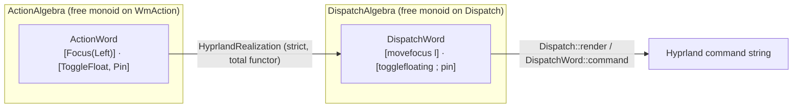

# Input -- Interaction modes and keybindings

Models user input as a structured two-layer ontology: **modes** are states in a statechart (Harel 1987), and **keybindings** are the morphisms that trigger transitions between them. Together they form the interaction algebra — the formal substrate for "what does this key do right now?" and "what keys are available in this context?".

Every rich-interaction surface (terminal, window manager, editor, shell, chat UI, WASM site) is a consumer: a surface loads a `ModeGraph` and a `KeybindingTable`, then routes every input event through them deterministically.

Key references:
- Harel 1987: *Statecharts: a visual formalism for complex systems* (Science of Computer Programming 8:3) — mode graphs, parallel regions, hierarchical states
- Thimbleby 2004: *User Interface Design with Matrix Algebra* (ACM TOCHI 11:2) — interaction as algebra over state and input
- Raskin 2000: *The Humane Interface* — monotony, modelessness discipline
- Beaudouin-Lafon 2000: *Instrumental Interaction* (CHI 2000) — the interaction algebra framing
- ECMA-48 5th Ed 1991 — terminal input conventions
- VT520/xterm escape sequences — the de facto terminal input grammar

## Entities

| Category | Entities |
|---|---|
| Modes (Harel) | `ModeId(String)`, `ModeProperties { catchall, parent, ... }`, `Transition { from, to }`, `ModeGraph { root, modes, transitions }` |
| Keys | `Key` — `Letter(char)`, `Number(u8)`, `Function(u8)`, `Named(NamedKey)`, `Mouse(MouseButton)` |
| Named keys | `Enter`, `Escape`, `Space`, `Tab`, `Backspace`, `Delete`, `Arrow{Up,Down,Left,Right}`, `Home`, `End`, `PageUp`, `PageDown` |
| Modifiers | `Shift`, `Ctrl`, `Alt`, `Meta` |
| Mouse buttons | `Left`, `Right`, `Middle`, `Scroll{Up,Down}` |

## Window actions — the intent / parameters / mechanism split

A keybinding's action is **not** a raw dispatcher string. `wm_action.rs` factors it into three layers so the user's *intent* is never conflated with the compositor *mechanism* that realizes it:

| Layer | Type | Examples |
|---|---|---|
| **Intent** | `WmAction` | `Focus(Direction)`, `Fullscreen`, `Maximize`, `Minimize`, `Workspace(WorkspaceTarget)`, `Close`, `Exec(String)` |
| **Parameters** | `Direction`, `WorkspaceTarget`, `Follow`, `Cycle` | `Left`/`Right`/`Up`/`Down`; `Index(u8)`/`Relative(i32)`/`Named`/`Special`; `Follow`/`Silent`; `Forward`/`Backward` |
| **Mechanism** | `Dispatch` (+ `Dispatch::render` — the one wire boundary) | `movefocus, l`; `fullscreen, 1`; `movetoworkspacesilent, special:hidden` |

`WmAction` is **open-world** (Reiter 1978): `Exec` carries an arbitrary external command, so the vocabulary is not finitely enumerable — it is a `Concept` but **not** `FinitelyGenerated`. `Fullscreen`, `Maximize`, and `Minimize` are **distinct** intents (EWMH keeps them as separate actions); on Hyprland they realize to `fullscreen`, `fullscreen, 1`, and a special-workspace emulation respectively (Hyprland has no native minimize). Hide is a separate generic move to a named special workspace.

## Axioms

| Axiom | Description | Source |
|---|---|---|
| (structural) | Identity and composition laws over the mode graph | auto-generated |
| RootModeIsUnique | A `ModeGraph` has exactly one root mode | Harel 1987 |
| TransitionsReferExistingModes | Every `Transition { from, to }` names modes that exist in the graph | well-formedness |
| EscapeReturnsToParent | If a mode has a parent, an Escape keybinding returns to the parent | Harel 1987 / Raskin 2000 |
| NoOrphanModes | Every non-root mode is reachable from the root via some transition | graph connectivity |
| FunctorIdentityLaw / FunctorCompositionLaw | `HyprlandRealization` preserves identity and composition (it is a strict, total functor) | Mac Lane 1971 II.1 |
| LoweringTotal | Every abstract action realizes to a non-empty dispatcher sequence | Goguen-Thatcher-Wagner 1978; GOMS 1983 |
| WindowStateActionsDistinct | `Fullscreen`, `Maximize`, `Minimize` realize to pairwise-distinct dispatchers | EWMH v1.5 / Myers 1988 |
| CompositeSequencePreserved | A composite action (float+pin) realizes to a two-dispatcher sequence, not an opaque command | Plotkin & Power 2003 |

See `modes.rs`, `keybindings.rs`, and `wm_action.rs` for the `impl Axiom for …` blocks.

## Functors

`HyprlandRealization : ActionAlgebra → DispatchAlgebra` (`wm_action.rs`) — the realization functor that lowers an abstract `WmAction` word to a concrete Hyprland dispatcher word. It is *forced* by the per-action lowering rule (Payne & Green 1986's rule-schema) and machine-proven to be a strict, total monoid homomorphism: "the runtime is a functor of the ontology." The single dispatcher string is emitted only at `Dispatch::render`.

The input ontology is also a substrate for every surface that needs modal input — the future `ChatSurface` will consume a `ModeGraph` for its chat-vs-command-vs-search modes, and the future `BrowserSurface` will expose a `KeybindingTable` for the site's navigation.

## Files

- `modes.rs` -- `ModeId`, `ModeProperties`, `Transition`, `ModeGraph`, mode-graph axioms, tests
- `keybindings.rs` -- `Key`, `NamedKey`, `Modifier`, `MouseButton`, keybinding tables + presets (typed `WmAction`), tests
- `wm_action.rs` -- `WmAction` intents, typed parameters, the `Dispatch` alphabet, the `HyprlandRealization` functor, domain axioms, tests
- `README.md` -- this file
- `citings.md` -- per-ontology bibliography
- `mod.rs` -- module declarations

Previous home: `applied/theming/modes.rs` + `applied/theming/keybindings.rs`, moved here by [#66](https://github.com/i-am-logger/pr4xis/pull/66).
