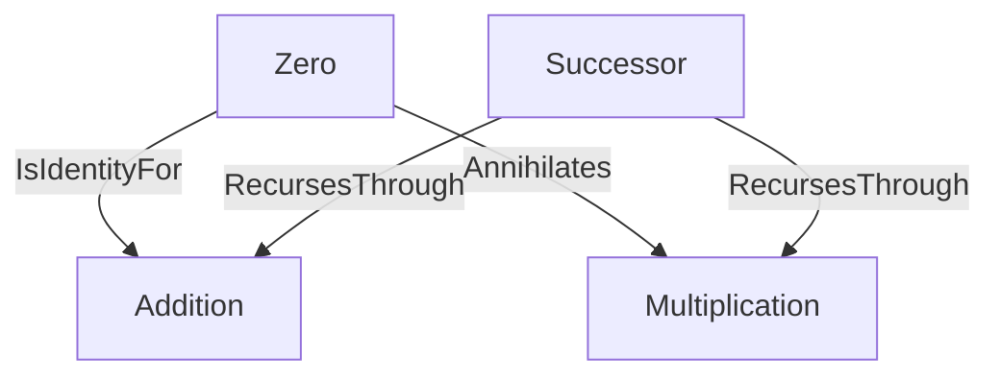

# PeanoArithmetic -- recursive addition and multiplication over the naturals

Models a 0-based zero/successor system and the two operations (addition,
multiplication) defined by primitive recursion over the successor
function -- and proves the calculator's actual evaluator
(`formal::calculator::op::BinaryOp`) satisfies that recursive definition,
rather than trusting it implicitly. The sibling `Number` ontology
(`formal/math/ontology.rs`) already places N at the base of the N/Z/Q/R/C
inclusion chain but carries no successor function or arithmetic laws;
this ontology supplies exactly that.

Citation note: earlier drafts of this ontology cited Peano (1889) and
Landau (1930) directly for the 0-based Zero/Successor/Addition/
Multiplication content. Both sources are 1-based (Landau's own Axiom 1
is "1 ist eine natürliche Zahl"; his addition/multiplication definitions
are §2 Satz 4 and §4 Satz 28, not §1 Satz 1/4, with base cases x+1=x'
and x·1=x) and so cannot honestly ground a 0-based system -- verified
against the primary text. Peano/Landau are kept below only as historical
framing for the name "Peano Arithmetic"; the formulas themselves are
Enderton's.

Key references:
- Enderton (1977), *Elements of Set Theory*, Academic Press, ch. 4 "Natural Numbers": Theorem 4D (p.71, the Peano system ⟨ω, σ, 0⟩), Theorem 4I (p.79, addition), Theorem 4J (p.80, multiplication) -- the 0-based axiomatization this ontology actually encodes.
- Peano (1889), *Arithmetices Principia, Nova Methodo Exposita*; Landau (1930), *Grundlagen der Analysis*: historical framing for the name "Peano Arithmetic" only (both 1-based).
- Hurford (1975), *The Linguistic Theory of Numerals*, Cambridge University Press, ch. 2: the closed-class basic (non-composed) numeral inventory realized in `numeral.rs`.

## Entities (4)

| Category | Entities |
|---|---|
| Peano axioms | Zero, Successor |
| Recursive operations | Addition, Multiplication |

## Edges

## Qualities

| Quality | Type | Description |
|---|---|---|
| RecursionStep | RecursionRole | Whether a concept is the base case (Zero) or recursive case (Successor) of a primitive-recursive definition. |

## Axioms (4)

| Axiom | Description | Source |
|---|---|---|
| ZeroIsIdentityForAddition | a+0=a, the base case of addition. | Enderton (1977) Theorem 4I, p.79 |
| ZeroAnnihilatesMultiplication | a×0=0, the base case of multiplication. | Enderton (1977) Theorem 4J, p.80 |
| CalculatorAdditionSatisfiesPeanoRecursion | `BinaryOp::Add.apply` satisfies a+0=a and a+S(b)=S(a+b) over the WAIS-IV single-digit band (0-9), checked against the real evaluator. | Enderton (1977) Theorem 4I, p.79 |
| CalculatorMultiplicationSatisfiesPeanoRecursion | `BinaryOp::Multiply.apply` satisfies a×0=0 and a×S(b)=(a×b)+a over the same band, checked against the real evaluator. | Enderton (1977) Theorem 4J, p.80 |

## Realized function

`value_of_numeral_word(word: &str) -> Option<Value>` (`numeral.rs`) --
Hurford (1975) ch. 2's closed-class basic numeral inventory (units,
teens, decade/hundred/thousand multiplier bases) as a small, hand-authored,
fully-cited table -- the same status as this crate's other closed
grammatical enumerations (a fixed linguistic category, not empirical/corpus
data; no CLDR/RBNF or comparable source is registered in this workspace to
load it from instead) -- bridging a numeral's written form to
`formal::calculator::value::Value`. Deliberately scoped to simple lexical
numerals, not composed phrases ("twenty-one") -- Hurford's base/multiplier
composition rules are a separate, larger grammar-integration task. The generated test
`every_binary_op_agrees_with_ground_truth_over_resolved_numerals` samples
every `BinaryOp` (Add/Subtract/Multiply/Divide/Power/Modulo) over resolved
numeral pairs in the same WAIS-IV band and asserts parse -> eval agrees
with directly-computed ground truth.

## Functors

**Outgoing (0):** No cross-domain functors yet.

**Incoming (0):** No cross-domain functors yet. Composes with (does not
map into) `formal::calculator` via direct function calls, proven by the
computational axioms above.

## Files

- `ontology.rs` -- Entities, edges, category, qualities, the two structural and two computational axioms, tests
- `numeral.rs` -- The closed-class basic-numeral lookup table, `value_of_numeral_word`, the A3 generated test over every `BinaryOp`
- `mod.rs` -- Module declarations
- `README.md` -- this file

Generated 2026-07-12.
