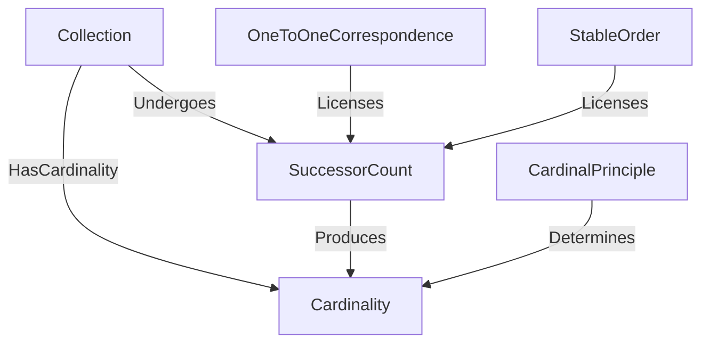

# Counting -- the arithmetic of finite pluralities

Models how a finite collection gets a cardinal number: Frege's logicist
account of what a "Number" is, and Gelman & Gallistel's three structural
principles (not merely procedural steps) a correct count must satisfy.
Kept as a small ontology adjacent to, not merged into, `MereologyTheory` --
mereology supplies "parts of a whole", counting supplies "how many",
composed rather than conflated (the turing-benchmark A4 keystone).

Key references:
- Frege (1884), *Die Grundlagen der Arithmetik* §§55-69: a cardinal number is a property of a *concept*, not of the objects falling under it.
- Gelman & Gallistel (1978), *The Child's Understanding of Number*: the one-to-one-correspondence, stable-order, and cardinal-principle requirements for a count to be correct.

## Entities (6)

| Category | Entities |
|---|---|
| Frege (3) | Collection, Cardinality, SuccessorCount |
| Gelman & Gallistel (3) | OneToOneCorrespondence, StableOrder, CardinalPrinciple |

## Taxonomy (is-a)

None -- all six concepts are siblings; the structure lives entirely in the
edges below (Collection undergoes SuccessorCount, which produces
Cardinality, licensed and determined by the three counting principles).

## Mereology (has-a)

Not applicable to this ontology directly -- `Counting` is *composed with*
`MereologyTheory` (see `../wordnet_grounding.rs`), not built from it.

## Edges

## Qualities

| Quality | Type | Description |
|---|---|---|
| CountingKind | CountingLineage | Which lineage (Frege / Gelman & Gallistel) introduces each concept. |

## Axioms (3)

| Axiom | Description | Source |
|---|---|---|
| SuccessorCountProducesCardinality | Correctly applied successor counting yields the collection's cardinality. | Frege (1884) §68 |
| AllThreePrinciplesLicenseCounting | One-to-one correspondence and stable order both license SuccessorCount as a correct procedure. | Gelman & Gallistel (1978) ch. 7 |
| CardinalPrincipleDeterminesCardinality | The cardinal principle *determines* (not merely licenses) the cardinality -- the last tag names the count. | Gelman & Gallistel (1978) ch. 7 |

## Realized function

`cardinality<T>(collection: &[T]) -> usize` -- the ontology's SuccessorCount
process made executable: one successor step per element, in slice order
(stable order), each element counted exactly once (one-to-one
correspondence), the final tag returned (cardinal principle). Proven equal
to slice length by property test (`prop_cardinality_equals_len`) for any
finite `Vec<i32>`, and used directly (not `.len()`) wherever this codebase
needs a cited justification for "how many", e.g. the mereology keystone's
generated test (`../wordnet_grounding.rs`).

## Functors

**Outgoing (0):** No cross-domain functors yet.

**Incoming (0):** No cross-domain functors yet. `../wordnet_grounding.rs`
*composes* `Counting::cardinality` with the mereology/WordNet grounding in
a single generated test, but does not itself map `Counting`'s concepts
into another ontology's category.

## Files

- `ontology.rs` -- Entities, edges, category, qualities, axioms, the `cardinality` function, tests (incl. a property test)
- `mod.rs` -- Module declarations
- `README.md` -- this file

Generated 2026-07-12.
