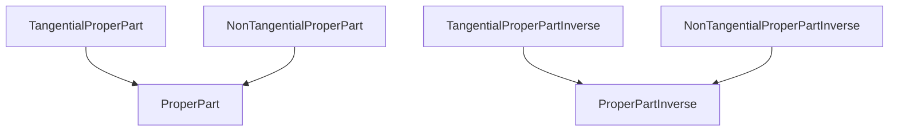

# RCC-8 -- Region Connection Calculus, the 8 base spatial relations

Models the Region Connection Calculus's 8 base topological relations (DC, EC, PO, TPP, NTPP, TPPi, NTPPi, EQ) — a jointly-exhaustive, pairwise-disjoint (JEPD) partition of every possible spatial relationship between two regions — plus the coarser RCC-5 "proper part" abstraction TPP/NTPP and TPPi/NTPPi refine. Realized as an exact classifier over closed 1-D intervals (`interval.rs`), the simplest region representation for which every relation is computable from four boundary comparisons. The substrate `natural::geography`'s `borders`/`contains` reasoning grounds in.

Key references:
- Randell, Cui & Cohn 1992: *A Spatial Logic Based on Regions and Connection*, KR'92
- Cohn, Bennett, Gooday & Gotts 1997: *Qualitative Spatial Representation and Reasoning with the Region Connection Calculus*, GeoInformatica 1(3)

## Entities (10)

| Category | Entities |
|---|---|
| RCC-8 base relations (8) | DisConnected, ExternallyConnected, PartiallyOverlapping, TangentialProperPart, NonTangentialProperPart, TangentialProperPartInverse, NonTangentialProperPartInverse, Equal |
| RCC-5 coarsening abstractions (2) | ProperPart, ProperPartInverse |

## Taxonomy (is-a)

TPP and NTPP are SIBLING refinements of the coarser RCC-5 "proper part" relation — neither subsumes the other (a proper part is either tangential or non-tangential, never both).

## Qualities

| Quality | Type | Description |
|---|---|---|
| EntailsConnection | bool | Does this relation entail the two regions are connected (`C(a,b)`, the calculus's sole primitive)? Every relation except DC. |

## Axioms (3)

| Axiom | Description | Source |
|---|---|---|
| ClassificationIsJointlyExhaustive | the realized classifier produces a deterministic, unique relation for each of the 8 canonical region-pair shapes | Randell, Cui & Cohn 1992 §3 |
| EqualityIsReflexive | every region is EQ to itself | Randell, Cui & Cohn 1992 §3 |
| ProperPartInversesAreSymmetricPairs | TPP/NTPP and TPPi/NTPPi swap when the argument order is reversed | Randell, Cui & Cohn 1992 §3 |

Plus the auto-generated structural axioms from `pr4xis::ontology!` (category laws on the is-a taxonomy).

## Realized mechanics

- `interval.rs` -- `Interval` (a closed `[start, end]` on the real line), `classify` (the exact RCC-8 classifier), `connected`. 3 property tests over generated interval pairs prove the classifier's inverse-symmetry and DC-iff-not-connected properties hold for ANY pair, not just hand-picked examples.

## Functors

No cross-domain functors yet. `natural::geography`'s `contains`/`borders` no longer call this module's `classify`/`connected` functions directly — GeoNames' real `countryInfo.txt` gazetteer carries no polygon/interval geometry to feed them, so `contains`/`borders` are realized straight from the loaded relational facts (continent membership; the neighbours adjacency list), and `natural::geography`'s own axioms verify Randell, Cui & Cohn (1992) §3's ALGEBRAIC properties of EC/TPP/NTPP (symmetry, irreflexivity, functional part-of) directly over the real data, citing the same paper this module realizes geometrically. `formal::mereology::counting` remains this module's function-call-composition precedent for the pattern generally.

## Files

- `ontology.rs` -- `Rcc8Concept` entities, category, `EntailsConnection` quality, 3 axioms, category/ontology tests
- `interval.rs` -- the realized 1-D interval classifier and its unit + property tests
- `mod.rs` -- module declarations
