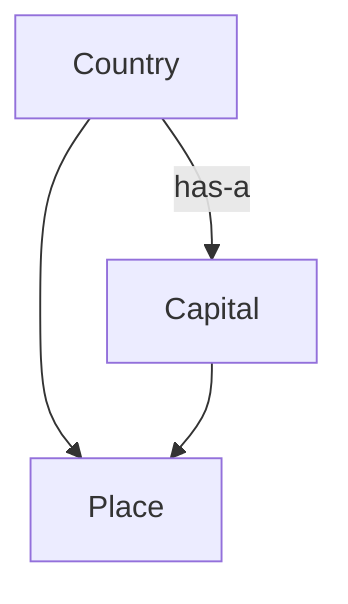

# Geography -- Place/Country/Capital/Region toponymy

Models Place/Country/Capital/Region toponymy over the REAL GeoNames `countryInfo.txt` gazetteer (`[sources.geonames_countryinfo]`, 252 countries/territories as of the 2026-07-21 dump) -- `contains`/`borders` load the loaded ISO/Country/Capital/Continent/neighbours facts, no hand-curated fixture. `contains` is Randell, Cui & Cohn's (1992) RCC-8 TPP/NTPP (proper-part) relation realized as continent membership; `borders` is the RCC-8 EC (externally-connected) relation realized as the (symmetrized) neighbours adjacency. GeoNames carries no polygon/interval geometry, so the 3 axioms verify the ALGEBRAIC properties Randell, Cui & Cohn (1992) §3 assign EC/TPP/NTPP (symmetry, irreflexivity, functional part-of) directly over the loaded data, rather than re-deriving through `formal::spatial::rcc8::interval::classify`'s geometric model (which has no footprint data to consume for real countries).

Key references:
- Randell, Cui & Cohn 1992: *A Spatial Logic Based on Regions and Connection*, KR'92
- ISO 3166-1 2020: *Codes for the representation of names of countries and their subdivisions*
- GeoNames.org `countryInfo.txt` -- the loaded instance data, licensed CC BY 4.0 (attribution required)

## Entities (4)

| Category | Entities |
|---|---|
| Toponymy (4) | Place, Country, Capital, Region |

## Taxonomy (is-a) and structure (has-a)

## Qualities

| Quality | Type | Description |
|---|---|---|
| IsContainer | bool | Does this concept classify a container (spatially contains others)? Only Region. |

## Axioms (3)

| Axiom | Description | Source |
|---|---|---|
| EveryCountryHasExactlyOneCapital | every Capital fact in the loaded gazetteer resolves, deterministically, to exactly that capital | ISO 3166-1 2020 |
| RegionContainmentIsRcc8ProperPart | every loaded country is contained by exactly one Region, agreeing with its Continent column -- RCC-8's antisymmetric/functional proper-part shape | Randell, Cui & Cohn 1992 §3 |
| BordersIsRcc8ExternalConnection | `borders` is symmetric (EC is its own converse) and irreflexive over the whole loaded gazetteer | Randell, Cui & Cohn 1992 §3 |

Plus the auto-generated structural axioms from `pr4xis::ontology!` (category laws on the is-a/has-a graph).

## Realized mechanics

- `reader.rs` -- interprets the generic TSV record stream (`applied::data_provisioning::decoders::plaintext_tsv`) as GeoNames' 19-column `countryInfo.txt` shape, producing `place::Country` rows.
- `store.rs` -- `GazetteerStore`: loads the committed `geonames_countryinfo@2026-07-21` `.prx` (via `raw_source_bytes_embedded`, the no_std/wasm-safe gated accessor), decodes, parses, SYMMETRIZES the directional `neighbours` adjacency (see its module doc -- GeoNames' own per-row lists are not perfectly mutually consistent for 2 defunct legacy ISO codes), and indexes by ISO code. Cached process-wide behind a `std`-only `OnceLock` (`gazetteer_loaded()`).
- `place.rs` -- `Place`/`Country`/`Region` types, `capital_of`/`contains`/`borders`, realized directly against the loaded relational facts (no synthetic 1-D footprint).
- `tests_loaded.rs` -- generated-from-loaded-data test families: a capital-of graph walk, an RCC containment walk, an RCC EC/borders walk (one assertion per real loaded row/edge, ~250-650+ assertions per run), and a regression lint asserting no literal toponym string from the real corpus appears in the production loader code.

## Honest scope

252 countries/territories as published in the 2026-07-21 GeoNames dump. A handful of uninhabited/non-sovereign entries (Antarctica, Bouvet Island, Heard Island & McDonald Islands, Tokelau, the U.S. Minor Outlying Islands, Bonaire/Saint Eustatius/Saba) carry no `Capital` -- loaded as `Option::None`, never silently coerced to an empty string or dropped from the corpus. The `neighbours` column is directional in the raw source and not perfectly mutually consistent (8 of 654 directed pairs disagree, all incident to the two defunct legacy entries `CS`/`AN`); `store::symmetrize` unions both directions rather than trusting either row alone.

## Functors

No cross-domain functors. `contains`/`borders` no longer compose against `formal::spatial::rcc8`'s `classify`/`connected` via direct function call (see `rcc8/README.md`'s own updated note) -- GeoNames carries no geometry to feed that geometric realization. The 3 axioms cite the SAME literature (Randell, Cui & Cohn 1992 §3) but check its algebraic relation-properties directly over the loaded data instead.

## Files

- `ontology.rs` -- `GeographyConcept` entities, category, `IsContainer` quality, 3 axioms (std-gated), category/ontology tests
- `place.rs` -- `Place`/`Country`/`Region` types, `capital_of`/`contains`/`borders`, and their unit tests (small inline fixtures, not the real corpus)
- `reader.rs` -- the GeoNames TSV field interpreter
- `store.rs` -- the loaded, symmetrized, indexed `GazetteerStore`
- `tests_loaded.rs` -- generated-from-loaded-data test families + the no-hardcoded-toponym regression lint
- `mod.rs` -- module declarations
