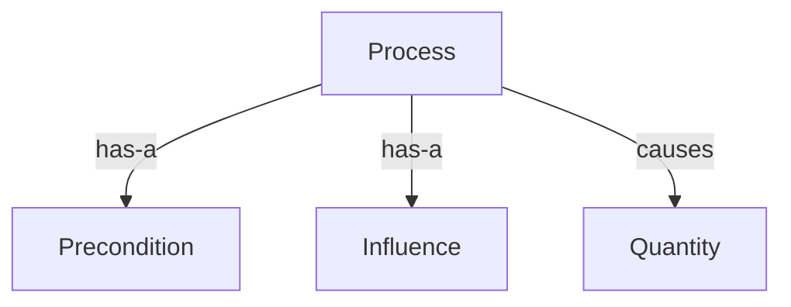

# Qualitative Process Theory -- Commonsense physical reasoning without numeric simulation

Models how physical systems change WITHOUT a differential equation: a process is active or inactive (determined entirely by whether its preconditions hold), and an active process's influence sets the qualitative SIGN of a quantity's derivative (increasing/steady/decreasing), never a rate (Forbus 1984). Complements this with Hayes's naive-physics containment/support claims: a container must be at least as large as its content, and an unsupported object falls. Together these answer commonsense physical questions the quantitative `natural::physics`/`kinematics` ontologies cannot ("why doesn't the trophy fit in the suitcase?" needs no differential equation).

Key references:
- Forbus 1984: *Qualitative Process Theory*, Artificial Intelligence 24(1-3)
- Hayes 1979: *The Naive Physics Manifesto*, in Michie (ed.) *Expert Systems in the Micro-Electronic Age*
- Hayes 1985: *Naive Physics I: Ontology for Liquids*, in Hobbs & Moore (eds.) *Formal Theories of the Commonsense World*
- de Kleer & Brown 1984: *A Qualitative Physics Based on Confluences*, Artificial Intelligence 24(1-3)
- Levesque, Davis & Morgenstern 2012: *The Winograd Schema Challenge*, KR 2012
- Sakaguchi, Bras, Bhagavatula & Choi 2020: *WinoGrande*, AAAI 2020

## Entities (7)

| Category | Entities |
|---|---|
| Forbus process theory (5) | Individual, Quantity, Process, Precondition, Influence |
| Hayes naive physics (2) | Containment, Support |

## Structure (has-a / causes)

`Containment` and `Support` are standalone relata concepts (mirroring `formal::mereology`'s `Part`/`Whole`): their content lives in the realized instance-level functions (`containment.rs`), not in structural edges to `Individual`.

## Qualities

| Quality | Type | Description |
|---|---|---|
| Origin | TheoryOrigin | Which founding paper a concept's formal treatment originates from (Forbus process theory vs. Hayes naive physics) |

## Axioms (4)

| Axiom | Description | Source |
|---|---|---|
| ProcessActiveRequiresAllPreconditions | a process is active iff every one of its preconditions is satisfied | Forbus 1984 §2.2 |
| ActiveProcessInfluencesQuantityDerivative | an active process's I+/I- influence sets the influenced quantity's derivative sign | Forbus 1984 §2.3 |
| ContainerSizeAtLeastContentSize | a container's size must be at least as large as what it holds | Hayes 1985 §3 |
| UnsupportedIndividualsFall | an individual with no support falls | Hayes 1979 |

Plus the auto-generated structural axioms from `pr4xis::ontology!` (category laws on the kinded relation graph).

## Realized mechanics

- `process.rs` -- `ProcessInstance`/`PreconditionInstance`/`InfluenceInstance`, `is_active`, `predicted_derivative` (the 1.5a material-physics test: for a precondition-satisfied process instance, the predicted derivative sign matches the axiom).
- `containment.rs` -- `Individual`/`Size`, `fits`, `too_big`/`too_small` (the 1.5b Winograd test: the antecedent, and its big/small swap, both fall directly out of `ContainerSizeAtLeastContentSize`'s size ordering — no discourse/centering computation), `falls_without_support`.

## Functors

Checked, not skipped: `mereology_grounding.rs` classifies every `QualitativeProcessConcept` against `formal::mereology::MereologyTheoryConcept` and the honest answer is a total negative. Following the `formal::mereology::wordnet_grounding` precedent (a plain `Option`-returning classifier, not a forced total `pr4xis::category::Functor`), `mereology_concept_of_qualitative_process` maps all 7 concepts -- including the two candidates, `Containment` and `Support` -- to `None`:

- `Containment` is a spatial LOCATION relation, not parthood. Casati & Varzi (1999) *Parts and Places* build parthood in Ch. 2 ("Parthood Structures") and treat location -- what a container/content pair actually instantiates -- as a separate structure in Ch. 6 ("Modes of Location", its own `Functionality`/`Conditional Reflexivity` primitives, p. 121). A marble inside a box occupies a region enclosed by the box's boundary without composing any part of the box.
- `Support` is a physical/causal relation (contact plus gravity), not part-whole at all -- Hayes (1979) never treats it as composition. A book resting on a table is not a part of the table.

Two axioms prove this: `NoQualitativeProcessConceptGroundsInMereology` (concept-level: the classifier's image is empty) and `HayesContainmentAndSupportStayUngroundedWhenExercised` (instance-level: real `containment::fits`/`falls_without_support` computations on concrete fixtures never coincide with a mereology classification).

## Files

- `ontology.rs` -- `QualitativeProcessConcept` entities, category, `Origin` quality, 4 axioms, category/ontology tests, the 1.5a/1.5b property tests
- `process.rs` -- Forbus process-theory realization (`is_active`, `predicted_derivative`) and its unit tests
- `containment.rs` -- Hayes naive-physics realization (`fits`, `too_big`, `too_small`, `falls_without_support`) and its unit tests
- `mereology_grounding.rs` -- the `QualitativeProcess -> formal::mereology::MereologyTheory` classifier (a total, honest `None`), its 2 axioms, and their tests
- `mod.rs` -- module declarations
