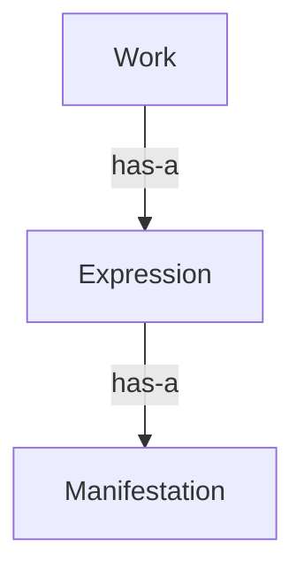

# FRBR -- Bibliographic Work/Expression/Manifestation hierarchy

Models the IFLA FRBR cataloging standard's Group 1 "WEMI" hierarchy — a Work is realized through one or more Expressions, each embodied in one or more Manifestations — plus Genre as a Group-3-adjacent classification. Genre grounds against WordNet's LOADED `has_domain_topic`/`domain_topic` relations rather than an invented taxonomy: a domain synset (e.g. "literature") carries a `has_domain_topic` edge to each of its member concepts, and each member carries the inverse `domain_topic` edge back to its domain.

Key references:
- IFLA FRBR Study Group 1998: *Functional Requirements for Bibliographic Records: Final Report*
- Miller 1995: *WordNet: A Lexical Database for English*, CACM 38(11)
- Bentivogli & Pianta 2004: *Extending WordNet with Syntagmatic Information*, Proc. GWC 2004
- Magnini & Cavaglià 2000: *Integrating Subject Field Codes into WordNet*, Proc. LREC 2000

## Entities (4)

| Category | Entities |
|---|---|
| Group 1 (products of intellectual/artistic endeavour) (3) | Work, Expression, Manifestation |
| Group-3-adjacent classification (1) | Genre |

## Structure (has-a)

`Genre` is a standalone classification concept — grounded via the realized WordNet accessors (`has_domain_topic`/`domain_topic`, on `English` since this ontology shipped), not a structural edge to Work/Expression/Manifestation.

## Qualities

| Quality | Type | Description |
|---|---|---|
| IsGroup1Entity | bool | Is this concept an FRBR Group 1 "product of intellectual or artistic endeavour" (Work/Expression/Manifestation), or a classification (Genre)? |

## Axioms (5)

| Axiom | Description | Source |
|---|---|---|
| WorkIsRealizedThroughAtLeastOneExpression | a work is realized through at least one expression | IFLA FRBR 1998 §3.2.1 |
| ExpressionIsEmbodiedInAtLeastOneManifestation | an expression is embodied in at least one manifestation | IFLA FRBR 1998 §3.2.2 |
| GenreGroundsInWordNetDomainTopic | keystone: the `wordnet_grounding_of_frbr` classifier maps `Genre -> Some(has_domain_topic, domain_topic)` and Work/Expression/Manifestation `-> None` | Bentivogli & Pianta 2004; IFLA FRBR 1998 §3.4 |
| GenreDomainTopicRoundTripsOnFixtureWordNet | the domain->member/member->domain pair round-trips on two representative hand fixtures (literature/epic, law/patent) | Bentivogli & Pianta 2004; Magnini & Cavaglià 2000 |
| GenreDomainTopicAgreesAcrossLoadedEnglishWordNet | the GENERATED test: swept over every real `has_domain_topic` edge under every loaded sense of "literature" (19+ in the current corpus) and every real `exemplifies` edge in the loaded genre-taxonomy subtree (currently 0 — see Honest scope) | Bentivogli & Pianta 2004; Miller 1995 |

Plus the auto-generated structural axioms from `pr4xis::ontology!` (category laws on the has-a chain).

The last three axioms (classifier, fixture, real-corpus sweep) live in `wordnet_grounding.rs`, mirroring `formal::mereology::wordnet_grounding`'s shape.

## Realized mechanics

- `work.rs` -- `WorkRecord`/`ExpressionRecord`, `is_realized`, `is_embodied`, `author_of`, `appears_in`.
- `wordnet_grounding.rs` -- `GenreWordNetGrounding` (rich type carrying the domain->member / member->domain `ConceptRef` pair), `wordnet_grounding_of_frbr` classifier, keystone axiom, fixture-composition axiom, and the real-corpus generated-sweep axiom.
- Accessors on `English` (`crates/domains/src/cognitive/linguistics/english/ontology.rs`): `has_domain_topic`, `domain_topic` (`exemplifies`/`is_exemplified_by` also exist on `English` but are NOT part of Genre's grounding — see Honest scope).

## Honest scope

Two corrections made during the 2026-07-21 re-verification pass (see `wordnet_grounding.rs`'s module doc for the full account):

1. **Direction.** `has_domain_topic`/`domain_topic` were previously documented (and fixture-tested) as "member -> domain" / "domain -> member". Direct inspection of the loaded `english-wordnet-2025.xml` shows the opposite: the DOMAIN synset carries `has_domain_topic` to its members, and the MEMBER carries `domain_topic` back. `English`'s doc comments and this module's fixture are now corrected to match.
2. **No real `exemplifies` edge exists under genre or literature.** The ontology's earlier claim that Genre also grounds via `exemplifies` (e.g. "epic exemplifies narrative poem") was an invented correspondence — a full corpus sweep (184 genre-taxonomy descendants, all 19 real `literature` domain-topic members, and all 1639 corpus-wide `exemplifies` edges) found zero real edge connecting any genre/literature-area concept via `exemplifies`. Genre's WordNet grounding below claims ONLY the `has_domain_topic`/`domain_topic` axis, which the loaded corpus substantially witnesses.

`GenreDomainTopicRoundTripsOnFixtureWordNet` is checked against two representative hand-authored WN-LMF fixtures, exactly as the sibling Turing-benchmark A4 mereology/counting grounding (`formal::mereology::wordnet_grounding::MereologyPartsAgreeWithLoadedMeronymyAndCounting`) is. `GenreDomainTopicAgreesAcrossLoadedEnglishWordNet` goes further than that A4 precedent (which has no real-corpus sweep yet) by walking the REAL loaded `english_loaded()` corpus — a genuine "for every real edge the loaded data has" iteration, not a fixed count.

## Functors

No cross-domain functors yet. The WordNet grounding in `wordnet_grounding.rs` is deliberately NOT a `pr4xis::category::Functor` impl, for the same reason `formal::mereology::wordnet_grounding` isn't one: a functor's `map_object` must be total over the source category, and only one of `FrbrConcept`'s four concepts (`Genre`) has an honestly-citable WordNet counterpart.

## Files

- `ontology.rs` -- `FrbrConcept` entities, category, `IsGroup1Entity` quality, `Work`/`Expression` axioms, category/ontology tests
- `wordnet_grounding.rs` -- the `Genre` WordNet-grounding classifier, keystone axiom, fixture-composition axiom, real-corpus generated-sweep axiom, and their tests
- `work.rs` -- realized Work/Expression mechanics and their unit tests
- `mod.rs` -- module declarations
