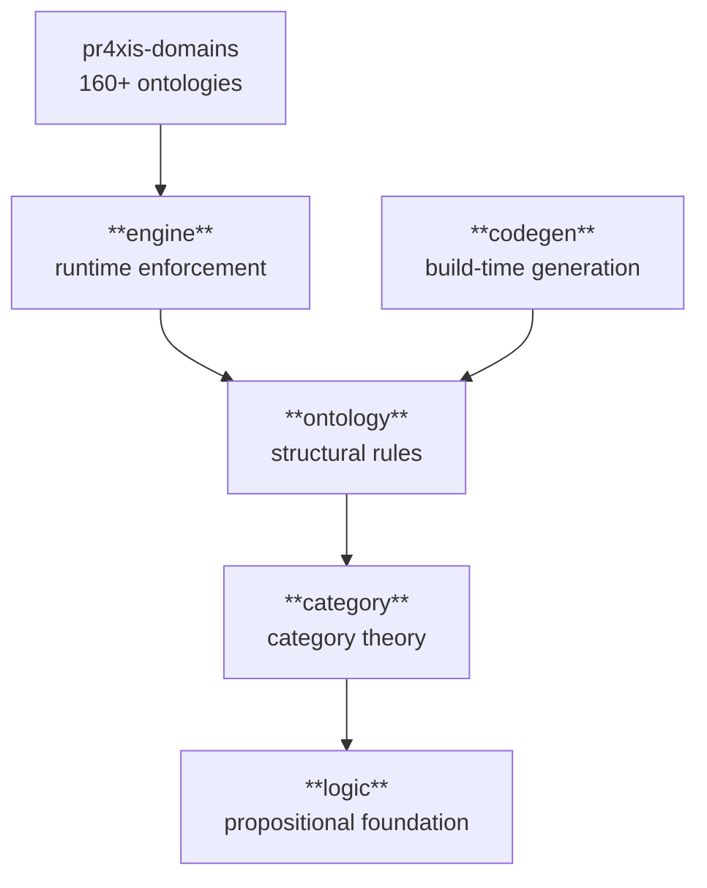
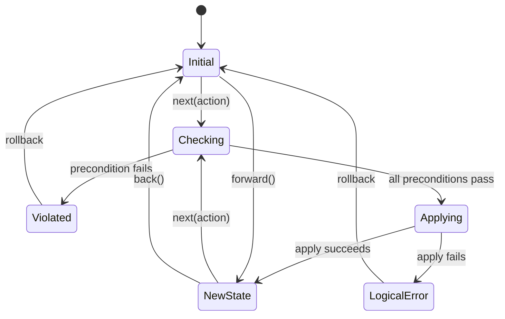
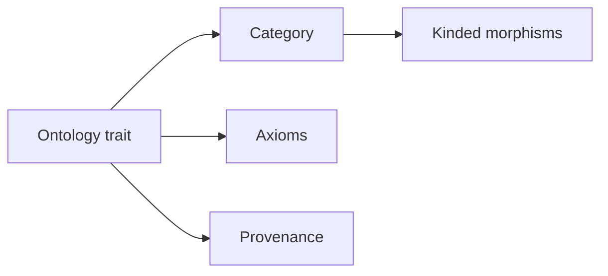

# Architecture

pr4xis is a five-layer Rust stack where each layer depends only on the layers below it. Domain knowledge lives in composable ontologies, not in mechanical processing logic — there is no parser-with-special-cases, no rule-engine-with-hardcoded-strings, no if-statements branching on domain values.

This document covers the abstract structure. For specific ontologies — what concepts they contain, what they connect to, what their adjunction discoveries look like — see the per-ontology READMEs ([#57](https://github.com/i-am-logger/pr4xis/issues/57)) and the per-ontology diagrams ([#59](https://github.com/i-am-logger/pr4xis/issues/59)).

## The five layers



These five layers are the conceptual frame; the crate also carries supporting modules (`entity_ref`, `xml_grammar`, `codegen_data`) alongside them. To see the actual top-level module list, run `ls crates/pr4xis/src/` or read the `pub mod` declarations in `crates/pr4xis/src/lib.rs`.

### `pr4xis::logic` — propositional foundation

Depends on nothing. Provides axioms, propositions, logical composition (`AllOf`, `AnyOf`, `Not`, `Implies`), the three modes of inference (deduction, induction, abduction), and the classical connectives with truth tables. Verified by `cargo test -p pr4xis logic`.

### `pr4xis::category` — category theory primitives

Depends on logic. Provides entities, relationships, categories, morphisms, functors, natural transformations, adjunctions, and the algebraic structures used throughout the stack: `Writer` monad (for tracing), `Monoid`, `Semigroup`, `Applicative`, `NonEmpty`, `Cofree` comonad, `Algebra` (F-algebras and recursion schemes), `Lens`. The category and functor laws live in `category::laws` as first-class `Axiom` impls — `assert_category_laws` and `assert_functor_laws` exercise them exhaustively and via [property-based testing](https://en.wikipedia.org/wiki/Software_testing#Property_testing), and each law's `verify()` returns a typed `Verdict` (a `Proof`, or a `Counterexample` naming what broke) rather than a boolean or an error string. Verified by `cargo test -p pr4xis category`.

### `pr4xis::ontology` — structural rules

Depends on category and logic. Defines what things ARE and how they relate. The `Ontology` trait bundles a category (`type Cat`), a quality (`type Qual`), and `fn axioms() -> Vec<Box<dyn Axiom>>` — the union of structural axioms inherited from the catalog and any domain axioms the ontology adds. The `ontology!` proc macro is the declarative entry point — author concept names, labels, and kinded edges (`is_a:` / `has_a:` / `causes:` / `opposes:` / free-form `edges:`) and the macro emits the `Concept` enum, the `Category` impl, the kinded `Arrow` impl, an `Ontology` impl whose `axioms()` calls `structural_axioms_for::<Self::Cat>()` to inherit the catalog's structural axioms (no cycles, antisymmetric subsumption, symmetric opposition, …), and a type-level `fn meta() -> Provenance` used by the engine for trace attribution. Verified by `cargo test -p pr4xis ontology`.

### `pr4xis::engine` — runtime enforcement

Depends on ontology, category, and logic. Defines how things CHANGE.



A new `next()` after `back()` clears the redo stack and starts a new branch from that point. Verified by `cargo test -p pr4xis test_back_forward_roundtrip` and `cargo test -p pr4xis test_next_after_back_clears_future`.

### `pr4xis::codegen` — declarative ontology data delivery

Depends on ontology. The mechanism for getting authoritative ontology data into the runtime. The layer name is `codegen` after the build-time path, but **codegen is one of several delivery options** — all of them are functors from the same `OntologyBuilder` source category, with categorical equivalence proven so that the choice between them is operational rather than semantic.

- **Build-time codegen** — the reference instance is `codegen::wordnet`, which converts the WordNet XML dictionary into a compiled English ontology of ~107K concepts emitted as static Rust.
- **Runtime async loading** — load ontology data from a file or stream asynchronously at runtime, materializing the same `OntologyBuilder` structure the codegen path produces.
- **Memory-mapped files** — mmap a precomputed ontology binary directly into memory, getting the data without parsing or copying.

All three produce the same ontology because each is a verified functor from the same source. The choice depends on deployment: build-time codegen for static binaries, async loading for hot reloading or for ontologies too large to embed, mmap for very large ontologies that need to share memory across processes.

For the largest ontologies, the runtime increasingly loads a **compact, content-addressed `.prx`** (see [Verifiable archives](#verifiable-archives)) instead of embedding static Rust: the English dictionary (~107K concepts) and U.S. Code both load this way — in the browser and on the command line — reading back in milliseconds without re-parsing the source. The compact `.prx` is smaller than fetching the source itself, so the read-back is the fast path and the original parse is the fallback.

The runtime side of delivery — *which* external sources praxis knows about and how their on-disk bytes get verified — lives under `pr4xis_domains::applied::data_provisioning`. A workspace-root **manifest** (`praxis.toml`) declares each registered source by name, version, taxonomy type, and authoritative URL; a workspace-root **lock** (`praxis.lock`) pins the content digest (tagged `blake3:<hex>`) each source's bytes must match. The `LockManifestAgreement` axiom fails closed on any drift between manifest, lock, and the file on disk. The `pr4xis update` CLI is the operator's interface to the same subsystem — see [Register a Source](../use/register-a-source.md) for the contributor workflow.

## Verifiable archives

A loaded source can be frozen into a small, self-contained, content-addressed `.prx` file. The runtime reads it back in a moment — instead of re-parsing the original source each time — and checks the archive's fingerprint before trusting it, refusing anything that has been altered; the same `.prx` can also rebuild the original source byte-for-byte. The ontology that describes this storage — content-addressable nodes, a Merkle DAG, a binary envelope, a source pin, and a load gate — lives in `crates/domains/src/formal/meta/ontology_archive/`; its runnable axioms exercise the real realisation.

Three pieces hold the property together:

- **A byte-exact round-trip.** The archived bytes reload to exactly what was packed; the content address re-derived from those bytes is the round-trip gate (`hash(out) == hash(in)`).
- **A fail-closed load gate.** On load, the gate re-derives the content address from the node's own bytes and admits the node only when that re-derived address equals the trusted pin recorded in `praxis.lock`. It never trusts an embedded self-asserted label; on mismatch, an unverifiable claim, or an absent pin, nothing is installed.
- **A typed, multi-algorithm `IntegrityClaim`.** Integrity is a verifiable claim binding a resource to its expected content hash (W3C Subresource Integrity, 2016), carried over a content-hash family that spans SHA-256, SHA-512, and BLAKE3 (`crates/domains/src/formal/meta/artifact_identity/`) rather than a single hard-coded algorithm.

The first realisation is the OWL leaf (`crates/domains/src/social/software/markup/xml/owl/prx.rs`): a registered OWL vocabulary, parsed once and frozen into a content-addressed `.prx` envelope the runtime materialises back without re-parsing the XML. **U.S. Code (USLM) text is a second, non-OWL consumer of the same archive machinery** — it is verified against the same archive axioms (the same lens round-trip, source-faithfulness, and fail-closed-gate laws), demonstrating that the storage ontology is not tied to OWL.

The same fail-closed discipline carries the **compact fast-load** path the runtime reads at startup. The English dictionary (WordNet, ~107K concepts) and each U.S. Code title freeze into a compact, content-addressed `.prx` — smaller than fetching the source — that `english_loaded()` and `usc_loaded()` read back in a fraction of a second, each verifying the archive's content address against a pin in `praxis.lock` (`[compact_archive_signatures]`) and refusing a tampered archive before any data is installed. The `pr4xis chat` CLI takes this pin-verified path for English today; its U.S. Code is still materialised from a build-time codegen static, and the browser embeds the compact English bytes under a build-time Merkle-root check rather than the `praxis.lock` pin.

The same primitive extends to a **content-addressed graph slice** (`crates/domains/src/formal/meta/praxis_knowledge_graph/`): select a subgraph, emit it as a deterministic content-addressed binary, reload it through the fail-closed gate, and re-bind the behavioural nodes by name, with the slice's outgoing references surfaced as explicit unbound references. Selecting the whole graph is the degenerate case of the same slice. This is the slicing primitive only — the negotiation that would let one node learn what another holds, and any wire transfer between nodes, is a separate, deferred layer, not part of this machinery.

## Runtime-loaded knowledge

A `.prx` is not only something the build produces — a running praxis can take one in. The runtime accepts a content-addressed `.prx` archive while it runs, verifies it, materialises it into a live ontology, and grounds it into the chat's lexical surface, so the chat answers from content it was not built with. Three steps carry the path, each in its own module:

- **A fail-closed admit.** `crates/pr4xis-runtime/src/load.rs` is the verify-before-interpret gate: `load(bytes, trusted_root)` decodes the bytes, re-derives the archive's Merkle root from the content it is about to admit, and accepts the archive only if that root equals the trusted root supplied from *outside* the bytes (a lock pin, or a caller-provided root). A self-asserted identity is never trusted; on a mismatch the result is a typed `LoadError::RootMismatch` and nothing is installed.

- **Materialisation into a live ontology.** `crates/pr4xis-runtime/src/ontology.rs` turns the admitted archive into a `RuntimeOntology`. Referential closure is validated first — an edge naming an undeclared node is a typed `DanglingEdge` error, never a silent skip. The transitive-relation closure (Subsumption, Parthood, Causation) is re-folded once from the archive's generating edges at `materialize` time — a stored closure is never trusted — so every later query (`reachable_from`, `is_a`, `subsumption_meet`) is an O(1) lookup into the pre-folded set rather than a traversal, and `is_a` returns a typed `Verdict` (a proof or a counterexample carrying the witnessed claim), not a boolean. Identity is the content address: two `RuntimeOntology`s are equal exactly when their archive roots agree.

- **Grounding into English.** `ComposedReasoner::new(english, loaded)` (`crates/domains/src/cognitive/linguistics/composed.rs`) composes the embedded English model with the loaded ontologies as one `LexicalReasoner`: each loaded node's surface form becomes a Lemon lexical entry whose reference is the typed `ConceptRef { ontology, name }` (McCrae et al. 2017), and word lookup is the union of the English lexicon and the grounded entries. Loaded concepts get `ConceptId`s in a range disjoint from English's, and taxonomy questions over them are answered from the loaded ontology's materialised closure — never by comparing names as strings.

The chat pipeline consumes this through one seam: `pr4xis_chat::process_with_reasoner` (`crates/chat/src/lib.rs`) threads a `&dyn LexicalReasoner` through the answer stages, so "what is X" reads the loaded gloss when X is loaded and abstains exactly as the embedded model already does when it is not. With no corpus loaded the reasoner is `English` itself (`process_with_metadata`), and behaviour is unchanged.

The browser demo runs the whole path end to end. `Pr4xis::load_ontology_prx` (`crates/wasm/src/lib.rs`) takes the bytes, a name, and the expected root in hex; the core runs load → materialise → install, rebuilding the `ComposedReasoner` on each load (idempotent by content address — re-loading the same root replaces rather than duplicates). `chat()` then dispatches through the composed reasoner when at least one `.prx` is loaded, and through English alone otherwise. A small demo archive ships embedded with its build-baked trusted root, so the path is exercisable without a network.

The current reach is deliberately narrow. This grounding path runs in the browser, for new-format content-addressed `.prx` archives; the `pr4xis chat` CLI (`crates/cli/src/main.rs`) still answers from the embedded English model alone via `chat::process`. The U.S. Code and OWL corpora that the browser loads at runtime are a different kind of load — they surface through the self-model catalog (`self_describe`) but are not yet consulted by the chat's linguistic pipeline.

## The Ontology trait

Every ontology in pr4xis is a category whose morphisms carry `Kind` tags. The `ontology!` macro emits the category, the kinded morphisms, the inherited structural axioms, and the type-level `Provenance` metadata used for trace attribution — all in a single declarative block.



The canonical relation kinds tracked by the structural-axioms catalog (OBO-RO; Smith et al. 2005) are:

- **Subsumption** (`is_a` sugar clause) — `NoCyclesOnKind` + `AntisymmetricOnKind` (Tarski 1941)
- **Parthood** (`has_a` sugar clause) — `NoCyclesOnKind`; `WeakSupplementation` available as a hand-written domain axiom (Casati & Varzi 1999)
- **Causation** (`causes` sugar clause) — `AsymmetricOnKind` + `IrreflexiveOnKind` (Lewis 1973; Reichenbach 1956)
- **Opposition** (`opposes` sugar clause) — `SymmetricOnKind` + `IrreflexiveOnKind`
- **Equivalence** — canonical properties (reflexive + symmetric + transitive) per Tarski (1941); when a catalog entry is added it will be inherited the same way
- **Context** — disambiguation by context (`ContextDef`, `resolve`)
- **Analogy** — structure-preserving maps between ontologies (functors as Analogies)

For what each looks like in a specific domain, see the per-ontology README. For the broader composition story — how ontologies talk to each other through proven functors and how adjunctions detect missing distinctions — see [Concepts](concepts.md).

## Domain organization

```text
crates/domains/src/
├── formal/        — math, information, calculator, meta (ontology diagnostics)
├── applied/       — sensor fusion, navigation, perception, tracking, space, underwater,
│                    industrial, localization, theming
├── social/        — games, software (HTTP, XML, OWL, RDF, LMF), judicial, compliance, military
├── natural/       — physics, biomedical, hearing, geodesy, colors, music
└── cognitive/     — linguistics, cognition (epistemics, metacognition)
```

Total: more than 160 ontologies; to count the current total, run `find crates/domains/src -name ontology.rs | wc -l`.

## Design decisions

**Domain knowledge lives in composable ontologies.** There is no parser-with-special-cases, no rule-engine-with-hardcoded-strings, no if-statements branching on domain values. Every domain is an ontology; every ontology is encoded as Rust code that the type system checks; every claim is a theorem with a proof.

**Situations are immutable.** Every action produces a new situation. The old one is preserved in the history stack. This enables undo, redo, and branching without mutation.

**Preconditions are separate from apply.** The precondition layer validates rules; the apply function transforms state. They are checked independently, so a precondition failure never partially applies a state change.

**EngineError returns the engine.** Both `Violated` and `LogicalError` return the engine so the caller can rollback. The system never panics — contradictions are data, not crashes.

**Rich enums carry context.** Every enum variant carries the data of HOW it got there. No information is lost between state transitions.

**Property-based testing is the primary verification.** Domain invariants are expressed as properties that hold for all generated inputs, not just hand-picked examples.

**The pipeline is a writer monad.** Tracing is not a separate concern bolted onto computations; pipelines are built as `Writer<PipelineTrace, A>` so trace entries accumulate via monoid composition rather than mutation.

## Related

- [README](../../README.md) — the project's main entry point and pitch
- [Concepts](concepts.md) — what ontologies are and how they compose via functors
- [Foundations](foundations.md) — academic lineage; every ontology traced to its source paper
- Per-ontology READMEs and citings — pending [#57](https://github.com/i-am-logger/pr4xis/issues/57)
- Per-ontology diagrams ("neural network of an ontology") — pending [#59](https://github.com/i-am-logger/pr4xis/issues/59)
- Source-of-truth report pipeline (live numbers from CI) — pending [#60](https://github.com/i-am-logger/pr4xis/issues/60)

---

- **Document date:** 2026-04-14
- **Verification:** the module layout is in `crates/pr4xis/src/lib.rs` (or `ls crates/pr4xis/src/`); the ontology count comes from `find crates/domains/src -name ontology.rs | wc -l`; the layer behaviour from the cited `cargo test` commands; and the archive machinery under `crates/domains/src/formal/meta/{ontology_archive,artifact_identity,praxis_knowledge_graph}` and `crates/domains/src/social/software/markup/xml/owl/prx.rs`.
